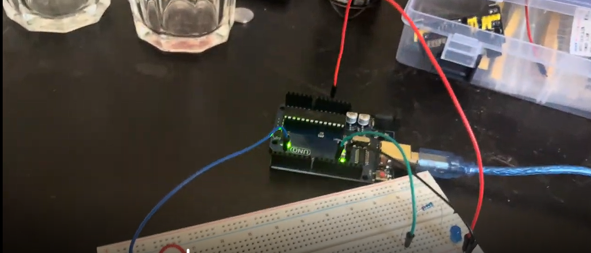

# Using a button 
Using a button as an input to turn on the LED.

I also learned how the circuit works using Claude AI to help me visualise the circuits. 

## Figure 1 - The whole circuit

##Figure 2 - The separate circuits

First, 5V is supplied to the circuit. A 5V voltage is connected to the button. If the button is not pressed, then the pull-down resistor lowers the voltage to approximately 0V by connecting the input to ground, so the input doesn't float. If the button is pressed, then a 5V is supplied to pin 2 via the node on the breadboard. This lets the Arudino board reads that the voltage is 'HIGH'.

Then the program I wrote compiles and if the voltage of the button is HIGH, If it is, a voltage is supplied to the LED through the jumper wire connected to pin 12, causing the LED to turn on.

## Video
Click Thumbnail to see the full Video demonstration of variable light intensity

